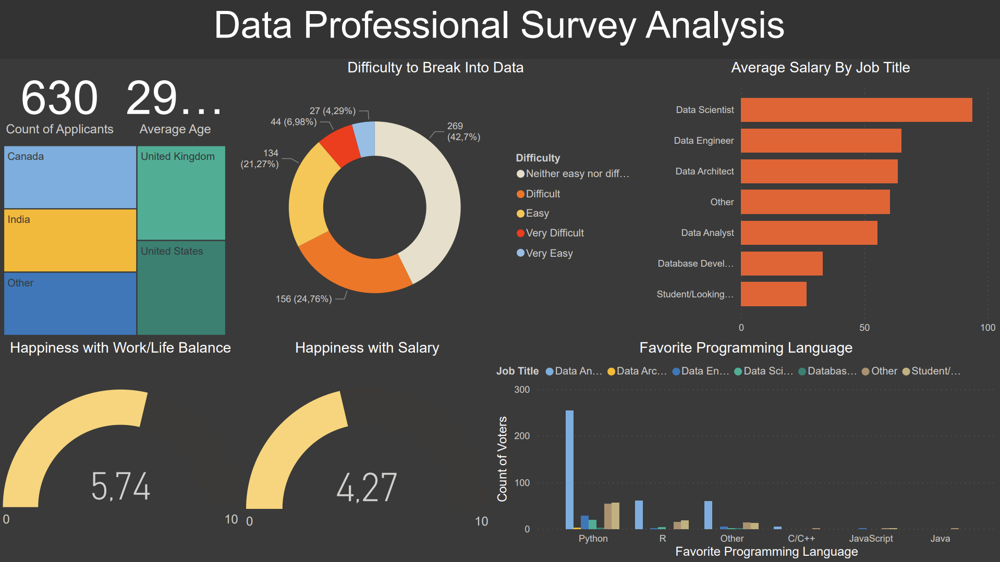

# Data Professional Survey Analysis

## Author
Kajus Martynkinas

## Overview
This project aims to examine and analyze the responses of a survey conducted among data professionals. The focus is on understanding the perspectives, preferences, and professional experiences of individuals in this field.

## Data Source
The analysis is based on survey data, which can be found here:
[Power BI - Final Project](https://github.com/AlexTheAnalyst/Power-BI/blob/main/Power%20BI%20-%20Final%20Project.xlsx)

## Analysis Summary
The survey gathered responses from 630 participants from various countries. Key findings include:
- Data Scientists have the largest salary.
- The preferred programming language among the majority is Python.
- A general consensus suggests ease of entry into the data field.
- However, average happiness ratings amongst the participants are noted to be relatively low.

## Tools Used
- PowerBI

This analysis offers insights into the current state of the data profession, reflecting the views and experiences of those in the industry.

